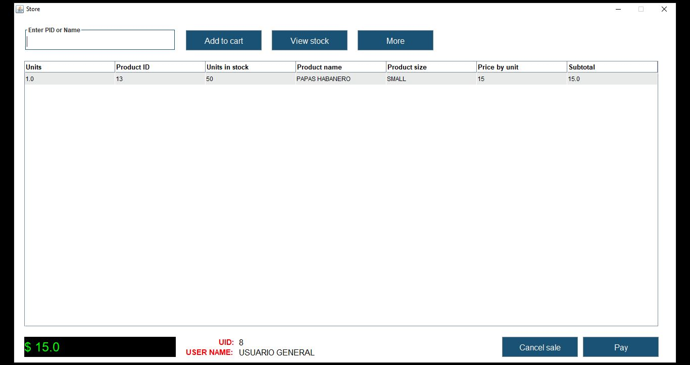

# CRUD en Java con MariaDB

<br><br><br>

## Descripción

Este proyecto es una aplicación CRUD (Crear, Leer, Actualizar, Eliminar) desarrollada en Java que utiliza MariaDB como base de datos. Es ideal para comprender la interacción entre una aplicación Java y una base de datos relacional.



## Características

- Gestión de registros.
- Operaciones CRUD implementadas:
    - Crear: Agregar nuevos registros a la base de datos.
    - Leer: Visualizar registros existentes.
    - Actualizar: Modificar registros existentes.
    - Eliminar: Remover registros de la base de datos.
- Conexión establecida con MariaDB a través de JDBC.
- Interfaz sencilla y funcional para gestionar datos.

## Requisitos

- **Java Development Kit (JDK)** 8 o superior.
- **MariaDB** (o MySQL compatible) instalado y configurado.
- **Maven** (opcional) para gestión de dependencias.
- Un IDE como IntelliJ IDEA, Eclipse, o NetBeans (opcional).

## Configuración

1. **Clona este repositorio** en tu máquina local:
  `git clone https://github.com/samoel-andres/crud_java_mariadb.git`

3. Este proyecto requiere de una base de datos, para ello requieres crear una base de datos y conectarla con este proyecto.

4. Ejectutar el proyecto:
   - Compila y ejecuta el proyecto desde tu IDE.
   - Alternativamente, usa la terminal:
   ```bash
   javac Main.java
   java Main
   ```

## Uso

1. Al iniciar la aplicación puedes interactuar con cada interfaz del proyecto.
2. Ingresa los datos necesarios en los formularios/campos respectivos.
3. Los cambios se reflejarán en la base de datos en tiempo real.

## Tecnologías utilizadas

- **Lenguaje**: Java
- **Base de datos**: MariaDB
- **Conector**: JDBC
- **Gestor de dependencias**: Maven (si se usa)
